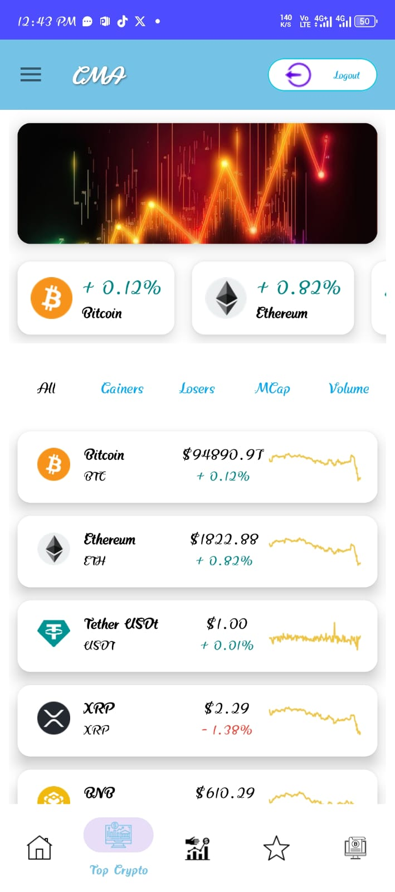
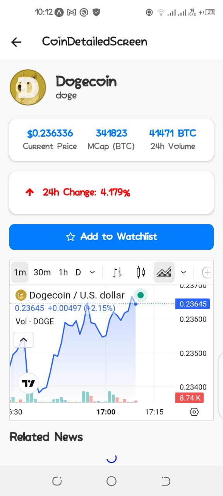
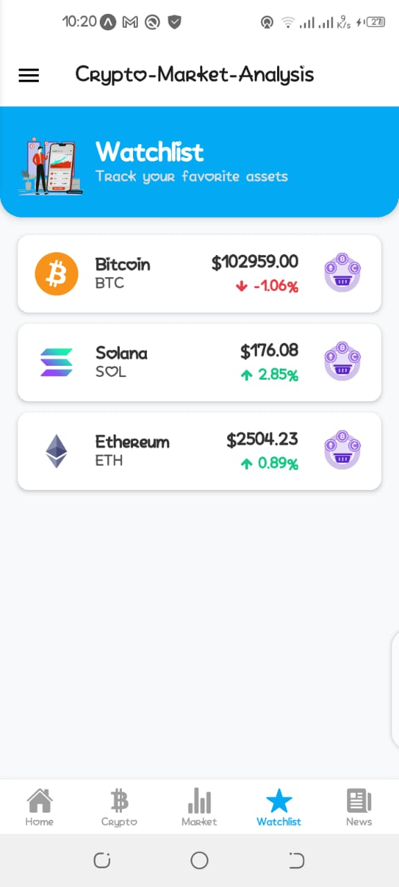
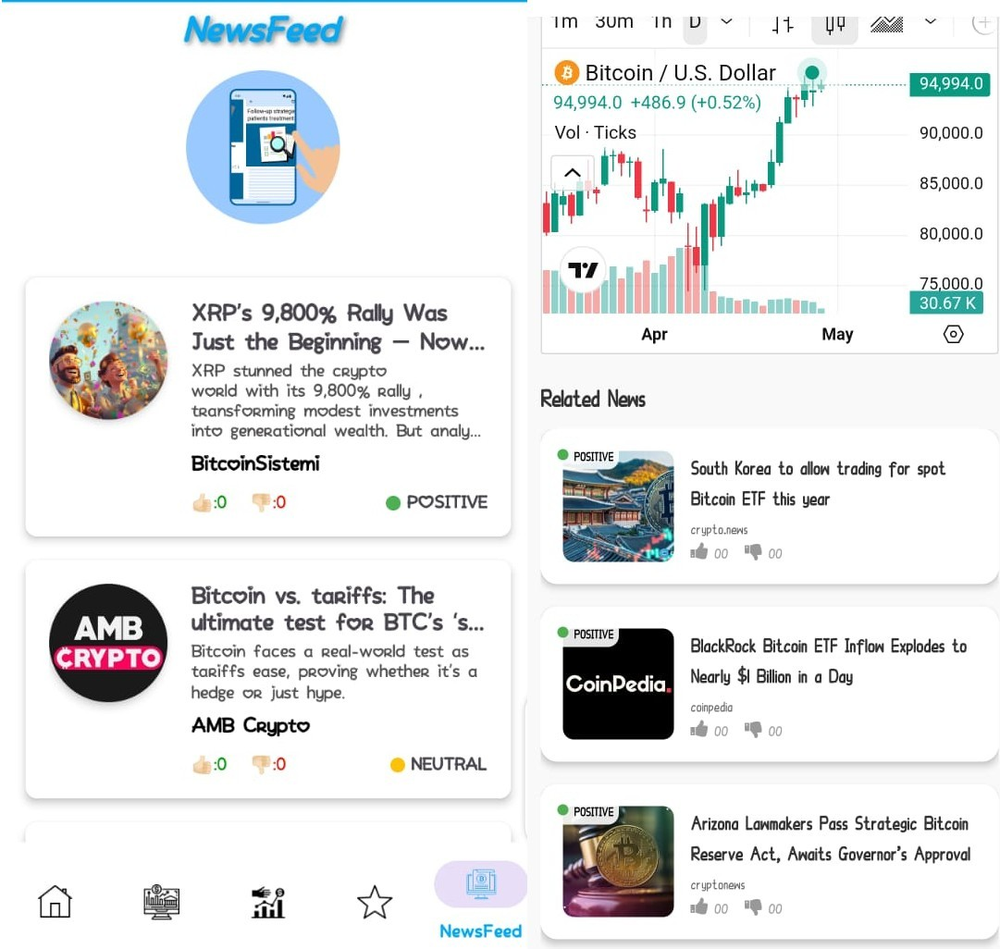

# CryptoMarket Android App

This is an Android application that provides users with real-time cryptocurrency market data, price alerts, news, and other useful features to help them navigate the world of crypto trading and analysis.

---

## 📱 Features

- 🔥 **Real-Time Cryptocurrency Data**: View current prices, market cap, and price changes for popular cryptocurrencies.
- 🔔 **Price Alerts**: Get notified when your favorite coins reach certain price levels.
- 📰 **Crypto News**: Stay up to date with the latest cryptocurrency news and developments.
- 💹 **Market Analysis**: View top gainers, losers, and detailed coin data.
- 📈 **Watchlist**: Track coins you’re interested in.
- 🔮 Price Prediction: Access predictions and forecasts for popular cryptocurrencies.
- 🎥 Beginner Videos: Watch educational videos and tutorials to understand the crypto market.
- 👥 Social Communities: Connect with other crypto enthusiasts to share insights and discuss market trends.

---

## 🖼️ Screenshots

| Home Screen | Detail Screen | Watchlist Screen | News Screen |
|-------------|---------------|------------------|-------------|
|  |  |  |   |

